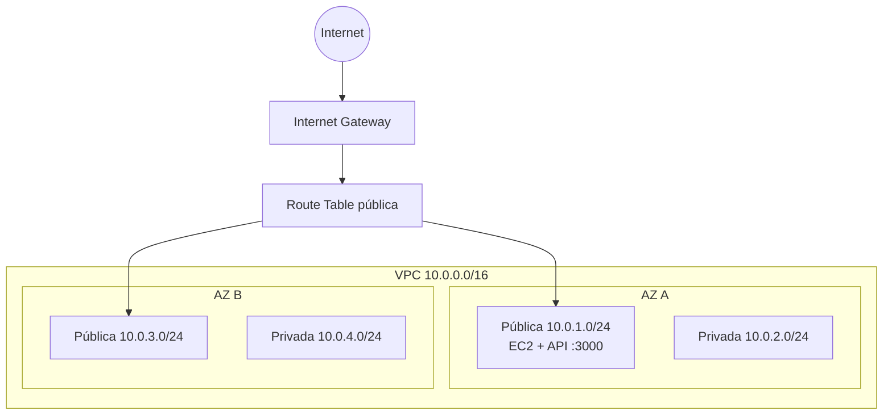

# Infraestrutura TechNova — Aula 04

Infraestrutura AWS criada com Terraform para executar uma API Node.js em uma EC2 pública, com rede Multi-AZ preparada para expansão.

## Arquitetura



As subnets privadas permanecem associadas à Route Table principal da VPC, sem rota para a internet.

## Pré-requisitos

- AWS CLI configurada com credenciais válidas do AWS Academy Learner Lab
- Terraform 1.5 ou superior
- Git
- OpenSSH para acessar a instância

Não faça commit de `.tfstate`, `.terraform/` ou `technova-key.pem`.

## Como usar

```bash
cd aula-04
aws sts get-caller-identity
terraform init
terraform fmt -check
terraform validate
terraform plan -out=technova.tfplan
terraform show -no-color technova.tfplan > evidencia-plan.txt
terraform apply technova.tfplan
```

Após o `apply`, aguarde cerca de 2 a 5 minutos para o User Data instalar o Node.js 18, clonar este repositório e iniciar o serviço.

## Como testar

```bash
terraform output
curl "$(terraform output -raw api_url)"
curl "$(terraform output -raw api_url)/health"
```

Para salvar a evidência da API:

```bash
curl "$(terraform output -raw api_url)" > evidencia-api.json
curl "$(terraform output -raw api_url)/health" >> evidencia-api.json
```

Teste por SSH e valide a identidade do Instance Profile:

```bash
SSH_COMMAND="$(terraform output -raw ssh_command)"
$SSH_COMMAND "node --version && aws sts get-caller-identity"
$SSH_COMMAND "node --version && aws sts get-caller-identity" > evidencia-ssh.txt
```

Se a API ainda não responder, verifique o User Data:

```bash
$SSH_COMMAND "sudo systemctl status technova-api --no-pager"
$SSH_COMMAND "sudo tail -n 100 /var/log/cloud-init-output.log"
```

## Decisões técnicas

- **Multi-AZ:** as quatro subnets estão distribuídas em duas zonas de disponibilidade, reduzindo a dependência de uma única AZ e permitindo adicionar um Load Balancer futuramente.
- **Separação pública/privada:** somente as subnets públicas recebem IP público e rota para o Internet Gateway. As privadas são reservadas para banco de dados e serviços internos.
- **Segurança e menor privilégio:** o SG da API abre somente SSH e a porta 3000; o SG do banco aceita PostgreSQL apenas do CIDR interno da VPC. Como o AWS Academy bloqueia a criação de IAM Roles, a EC2 utiliza o `LabInstanceProfile` disponibilizado pelo Learner Lab.  
- **Inicialização automática:** o User Data instala Node.js 18 e Git, clona o projeto, executa `npm install` e registra a API como serviço systemd.
- **Chave SSH:** o Terraform cria a chave e salva a parte privada localmente com permissão `0600`; o `.gitignore` impede seu versionamento.

## Recursos criados

| Recurso | Nome | Função |
|---|---|---|
| VPC | `technova-vpc` | Rede isolada `10.0.0.0/16` |
| 2 subnets públicas | `technova-subnet-public-*` | Recursos acessíveis pela internet em duas AZs |
| 2 subnets privadas | `technova-subnet-private-*` | Camada interna sem rota pública |
| Internet Gateway | `technova-igw` | Conectividade da VPC com a internet |
| Route Table pública | `technova-rt-public` | Rota padrão para o IGW |
| Route Table padrão | `technova-rt-private-default` | Rotas locais das subnets privadas |
| SG da API | `technova-api-sg` | Libera TCP 22 e 3000 |
| SG do banco | `technova-db-sg` | Libera TCP 5432 apenas dentro da VPC |
| Key Pair | `technova-key` | Autenticação SSH |
| Instance Profile | `LabInstanceProfile` | Perfil fornecido pelo AWS Academy e anexado à EC2 |
| EC2 | `technova-api-ec2` | Executa a API Node.js na porta 3000 |

## Limpeza obrigatória

Depois de capturar todas as evidências:

```bash
terraform destroy
```

Confirme digitando `yes`. Ao final, confira no console do AWS Academy se não restou nenhuma instância em execução.

## Evidências esperadas

- `evidencia-plan.txt`: plano do Terraform sem cores
- `evidencia-api.json`: respostas de `/` e `/health`
- `evidencia-ssh.txt`: versão do Node.js e identidade IAM da EC2
- screenshot do `terraform apply`/outputs, se solicitado pelo professor

Os arquivos locais de evidência estão ignorados pelo Git para evitar publicar dados temporários. Copie seus outputs relevantes para a documentação da entrega antes do PR.
